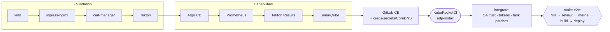

# try-kuberocketci — run the full KubeRocketCI platform locally in kind

> **Spin up the complete [KubeRocketCI](https://docs.kuberocketci.io) (KRCI) CI/CD
> platform on your laptop in two commands** — a self-hosted GitLab, Tekton CI,
> Argo CD for GitOps delivery, SonarQube code quality, Prometheus + Grafana, and the
> KubeRocketCI Portal — all inside a disposable `kind` cluster on Docker Desktop.

[](LICENSE)
[](https://docs.kuberocketci.io)
[](https://kind.sigs.k8s.io/)
[](https://tekton.dev/)
[](https://argo-cd.readthedocs.io/)
[](https://www.sonarsource.com/products/sonarqube/)
[](https://about.gitlab.com/)
[](CONTRIBUTING.md)

**`try-kuberocketci`** is a local, reproducible **test bed / sandbox** for
KubeRocketCI — an open-source **internal developer platform (IDP)** for
cloud-native CI/CD on Kubernetes. It lets you evaluate, demo, learn, and develop
against a *complete* KRCI platform without any cloud account: everything runs in a
single-node `kind` cluster and tears down with one command. Component versions are
pinned to the GitOps source of truth
([edp-cluster-add-ons](https://github.com/epam/edp-cluster-add-ons)), but installed
directly with `helm`/`kubectl` instead of Argo CD — so you can stand the platform
up with a couple of commands and poke at any component in isolation.

**What you get, locally:**

- **Self-hosted GitLab CE** — the SCM, wired for webhook-triggered pipelines
- **Tekton Pipelines/Triggers/Results** — the CI engine and run history
- **Argo CD** — GitOps continuous delivery
- **SonarQube Community** — static analysis and quality gates
- **Prometheus + Grafana** — metrics and dashboards
- **KubeRocketCI Portal** — the platform UI, in-cluster
- **A real, automated end-to-end run** — `make e2e` drives MR → review → merge →
  build → deploy and asserts the app is live, no clicking required
- **GitLab CI as an alternative CI engine** (multi-CI) — set `ciTool: gitlab` to run
  pipelines in GitLab CI on an in-cluster runner instead of Tekton; `make e2e-gitlabci`
  proves it green. See [docs/gitlab-ci.md](docs/gitlab-ci.md)

---

## Table of contents

- [What is KubeRocketCI?](#what-is-kuberocketci)
- [Who is this for?](#who-is-this-for)
- [Prerequisites](#prerequisites)
- [Quick start](#quick-start)
- [Architecture](#architecture)
- [What `make testbed` installs](#what-make-testbed-installs)
- [Credentials (local only)](#credentials-local-only)
- [Targets](#targets)
- [End-to-end test (`make e2e`)](#end-to-end-test-make-e2e)
- [Local deviations & patches](#local-deviations--patches)
- [Repository layout](#repository-layout)
- [FAQ](#faq)
- [Documentation](#documentation)
- [Contributing](#contributing)
- [License](#license)

## What is KubeRocketCI?

[**KubeRocketCI**](https://docs.kuberocketci.io) (KRCI, or "Rocket") is an open-source,
Kubernetes-native **internal developer platform**
that assembles best-of-breed tools — Tekton, Argo CD, SonarQube, and your Git
provider — into a cohesive, opinionated CI/CD experience. It manages the lifecycle
of your **Codebases** (applications, libraries, autotests) from source through
review, build, and GitOps-based deployment, exposing it all through a single Portal.

This repository is **not** KubeRocketCI itself — it's a **local installer and test
harness** that brings the whole platform up on your machine so you can try it,
reproduce issues, or develop integrations against it.

## Who is this for?

- **Platform / DevOps engineers** evaluating KubeRocketCI before adopting it.
- **Contributors** to KRCI who need a fast, disposable, from-zero reproduction.
- **Developers** who want to understand the Tekton + Argo CD + SonarQube + GitLab
  CI/CD flow end-to-end without standing up cloud infrastructure.
- **Anyone learning** cloud-native CI/CD, GitOps, and platform engineering by
  reading a real, working, fully-wired example.

## Prerequisites

- **Docker Desktop**, **≥ 8 GB RAM** (the full bed with GitLab + SonarQube wants
  **12 GB+**).
- `kind`, `helm`, `kubectl` on `PATH` (`make tools` installs `kind` via brew).
- macOS (Apple Silicon or Intel) or Linux. On Apple Silicon, amd64-only images
  (Portal, GitLab, sonar-operator) run under Docker Desktop's Rosetta.

## Quick start

```bash
make testbed   # ~18-20 min: all dependencies, then KubeRocketCI installed LAST
make e2e       # ~12 min: MR -> review -> merge -> build -> deploy; PASS = all green + app deployed
```

`make testbed` builds in **dependency order** and installs KubeRocketCI **last** so
the chart wires itself to what's already up:

```
cluster → ingress → cert-manager → Tekton → Argo CD → Prometheus → Tekton Results → SonarQube
        → gitlab-up          deploy GitLab + bootstrap creds/secrets
        → krci               install KubeRocketCI (edp-install)
        → gitlab-integrate   wire GitLab to KubeRocketCI
        → argocd-integrate   wire Argo CD to KubeRocketCI
        → sonar-integrate    wire SonarQube to KubeRocketCI
```

Each `*-integrate` step wires a component to KubeRocketCI after it's installed. See
[docs/architecture.md](docs/architecture.md) for the full design.

```bash
make status    # cluster + KRCI + capabilities overview (also prints values for the Portal .env)
make token     # mint a 24h Portal login token
make down      # delete the kind cluster
```

Full from-zero validation: `make down && make testbed && make e2e`.

## Architecture

KubeRocketCI is installed **last**, after every dependency it wires to is already
running — the **deps-first / KRCI-last** principle:



The platform install itself uses `helm`/`kubectl` (not Argo CD GitOps) so each
component is **independently rebuildable** and debuggable. The *workloads*
KubeRocketCI deploys still go through Argo CD. Read the design docs:

- **[docs/architecture.md](docs/architecture.md)** — deps-first / KRCI-last,
  baseline → integrate, split-horizon DNS, the three CA-trust injection points, the
  task patches, and the CI → CD lifecycle.
- **[docs/gitlab-integration.md](docs/gitlab-integration.md)** — the self-hosted
  GitLab webhook path in depth.
- **[docs/gitlab-ci.md](docs/gitlab-ci.md)** — running CI in **GitLab CI instead of
  Tekton** (`ciTool: gitlab`): the injected `.gitlab-ci.yml`, the mirrored
  `ci-java17-mvn` component, the GitLab Runner, and the local deviations.

## What `make testbed` installs

| Layer        | Component                                  | Version                         | Namespace        |
|--------------|--------------------------------------------|---------------------------------|------------------|
| Cluster      | kind (k8s)                                 | v1.35.0                         | —                |
| Ingress      | ingress-nginx                              | controller-v1.11.3              | ingress-nginx    |
| Certs        | cert-manager                               | v1.16.2                         | cert-manager     |
| CI engine    | Tekton Pipelines / Triggers                | v1.6.2 / v0.36.0                | tekton-pipelines |
| Platform     | KubeRocketCI (edp-install)                 | 3.13.5                          | krci             |
| Monitoring   | kube-prometheus-stack (+Grafana)           | 84.5.0                          | monitoring       |
| Run storage  | Tekton Results (+ minimal Postgres)        | v0.20.0                         | tekton-pipelines |
| CD engine    | Argo CD (single instance)                  | chart 9.5.17 / v3.4.3           | argocd           |
| Code quality | SonarQube (+ own Postgres, sonar-operator) | chart 2025.3.1 / 25.5-community | sonar            |
| SCM          | GitLab CE (+ Container Registry)           | 17.5.1-ce                       | gitlab           |

KubeRocketCI core pods (ns `krci`): `cd-pipeline-operator`, `codebase-operator`,
`gitfusion`, `tekton-cache`, `tekton-interceptor`, `krci-portal`. On Apple Silicon,
the Portal and other amd64-only images run under Docker Desktop's Rosetta; the
Portal serves `https://portal.127.0.0.1.nip.io`.

## Credentials (local only)

> **LOCAL USE ONLY.** Fixed, predictable credentials baked into a throwaway
> `kind` cluster. They are **not secret** and must **never** be used on any shared,
> internet-reachable, or production cluster. Everything serves over plain HTTP /
> self-signed TLS with no real SSO. See [SECURITY.md](SECURITY.md).

| Component | URL                               | User    | Password            |
|-----------|-----------------------------------|---------|---------------------|
| GitLab    | <https://gitlab.127.0.0.1.nip.io> | `root`  | `KrciLocal_2026!`   |
| SonarQube | <https://sonar.127.0.0.1.nip.io>   | `admin` | `KrciSonar_2026!`   |
| Argo CD   | <http://argocd.127.0.0.1.nip.io>  | `admin` | *(chart-generated)* |
| Grafana   | <http://grafana.127.0.0.1.nip.io> | `admin` | `prom-operator`     |

`make status` prints the live passwords for every UI. The **Portal** uses a 24h
Kubernetes bearer token (`make token`), not a password.

## Targets

`make help` lists everything. Build piecemeal or all at once — each capability
target is independent and idempotent, so you can rebuild/debug one component without
touching the rest.

```bash
make up               # prerequisites only: cluster -> ingress -> cert-manager -> tekton -> argocd
make prometheus       # add kube-prometheus-stack + Grafana
make tekton-results   # add Tekton Results + its minimal Postgres
make sonar            # add SonarQube + own Postgres + sonar-operator + CRs
make argocd           # add Argo CD (single instance) + krci AppProject
make gitlab-up        # (pre-krci)  deploy GitLab + bootstrap creds/secrets
make krci             # install KubeRocketCI (edp-install)
make gitlab-integrate # (post-krci) wire GitLab to KubeRocketCI
make argocd-integrate # (post-krci) wire Argo CD to KubeRocketCI
make sonar-integrate  # (post-krci) wire SonarQube to KubeRocketCI
make testbed          # the full platform, in the order shown above

make status           # cluster + KRCI + capabilities overview + values for the Portal .env
make token            # 24h cluster-admin bearer token (Portal login)
make e2e              # MR -> review -> merge -> build -> deploy (demo/dev)
make e2e-java         # Java/Maven -> GitLab Package Registry (Tekton CI)
make krci-dry-run     # render the edp-install chart without installing
make down             # delete the kind cluster

# GitLab CI instead of Tekton (multi-CI) — see docs/gitlab-ci.md
make gitlab-ci        # set up: install the GitLab Runner + mirror the ci-java17-mvn component + onboard the Java app
make e2e-gitlabci     # MR -> review pipeline -> merge -> build pipeline; PASS = both green (GitLab CI, not Tekton)
```

### Snapshot mode (`SNAPSHOT=true`)

`SNAPSHOT=true make testbed` installs the KRCI charts from the **snapshot** helm repo
(`https://epam.github.io/edp-helm-charts/snapshot`, semver pre-releases via `--devel`)
instead of the pinned release. The umbrella `edp-install` then renders only the shared
base (all subcharts disabled) and each component becomes its **own helm release** —
CRD-owning operators first, then `edp-tekton`, `gitfusion`, `krci-portal` — mirroring
the per-chart layout of the KRCI dev GitOps environments. Snapshot scope is
`edp-install` and its subcomponents ONLY: SonarQube and `sonar-operator` always
install from their stable pins regardless of the switch. Release names equal chart
names, so every resource keeps the name the umbrella would give it and
`status`/`*-integrate`/`e2e` work unchanged.

- Per-chart values live in `values/snapshot/` (the umbrella sections of
  `values/edp-install.yaml` flattened; `global.yaml` is passed to every release
  because standalone charts don't inherit umbrella globals).
- Pick a mode **per cluster** (from scratch only) — `make down` first to switch.
- Re-roll one chart: `make snapshot-edp-tekton`; pin a version:
  `SNAP_VERSION_edp-tekton=0.27.0-SNAPSHOT.30`; list versions: `make snapshot-versions`.
- The portal image is digest-pinned to the amd64 variant in
  `values/snapshot/krci-portal.yaml` (arm64 snapshot builds still crash on
  better_sqlite3) — re-pin when bumping.

## End-to-end test (`make e2e`)

`scripts/e2e.sh` drives the whole CI→CD lifecycle, fully automated (no UI), against
the Codebase `test-go-app` (go/gin) in `manifests/sample-codebase.yaml`:

```txt
1. operator creates GitLab project krci/test-go-app + a project webhook
2. open an MR     -> review PipelineRun -> assert fully green (incl. sonar)
3. merge the MR   -> build  PipelineRun -> assert fully green; kaniko pushes the image
4. read the built tag from CodebaseImageStream test-go-app-main
5. create CDPipeline "demo" + Stage "dev" (manifests/cdpipeline-demo.yaml)
6. CDStageDeploy that tag -> deploy PipelineRun -> Argo CD syncs the deploy-templates
   Helm chart into ns krci-demo-dev; assert the workload is Available on the built tag
```

Opening or updating the MR triggers the review pipeline; **merging** it — not a
separate push — kicks the build. All PipelineRuns are recorded in Tekton Results.

GitLab is a **platform dependency**: it comes up before `make krci`. See
[docs/architecture.md](docs/architecture.md) for the deps-first / KRCI-last design.

> **Known quirk:** GitLab can deliver the MR webhook twice, creating two concurrent
> runs; the second gets a harmless `400` posting the same commit-status context.

## Local deviations & patches

This test bed differs from a stock, GitOps-managed KubeRocketCI install in a few
deliberate ways. Each is documented in full — with the rationale — in
**[docs/architecture.md](docs/architecture.md)**; this is the summary:

| Area           | Deviation                                                                                                                                 |
|----------------|-------------------------------------------------------------------------------------------------------------------------------------------|
| Install method | `helm`/`kubectl`, not Argo CD GitOps, so each component is debuggable in isolation (versions still pinned to edp-cluster-add-ons)         |
| Portal         | in-cluster subchart; runs under Rosetta on Apple Silicon; OIDC disabled — ServiceAccount-token login only (`make token`)                  |
| Tekton tasks   | `gitlab-set-status` and `deploy-applicationset-cli` patched for self-signed GitLab / plaintext Argo CD, re-applied after each `make krci` |
| Argo CD        | single instance (not HA), chart `9.5.17`, plus an apps-in-any-namespace RBAC addition the chart omits                                     |
| SonarQube      | own minimal Postgres instead of the bundled DB / Crunchy PGO                                                                              |
| Tekton Results | single stock `postgres:16-alpine` (no Crunchy PGO)                                                                                        |
| GitLab         | self-hosted dependency on self-signed HTTPS; CoreDNS split-horizon + containerd registry mirror                                           |
| Registry       | reuses GitLab's own Container Registry at `:5050` instead of a separate one                                                               |
| Chart source   | optional `SNAPSHOT=true` mode installs pre-release charts, one release per chart (see [Snapshot mode](#snapshot-mode-snapshottrue))       |
| Image cache    | `make preload` (auto in `gitlab-up`) keeps the ~3GB GitLab image in the host docker cache so rebuilds skip the download                   |

For the how and why behind each row, see [docs/architecture.md](docs/architecture.md)
and [docs/gitlab-integration.md](docs/gitlab-integration.md).

## Repository layout

```
Makefile                                # all orchestration (versions pinned at top; make help)
kind/cluster.yaml                       # single-node kind, ports 80/443 -> localhost, registry mirror
values/edp-install.yaml                 # KubeRocketCI chart values (in-cluster portal on, amd64 image)
values/snapshot/                        # SNAPSHOT mode: per-chart values (umbrella base + one file per release)
values/kube-prometheus-stack.yaml       # Prometheus + Grafana values
values/argo-cd.yaml                     # Argo CD chart values (single instance)
values/sonarqube.yaml                   # SonarQube chart values (community, external jdbc)
values/gitlab-runner.yaml               # GitLab CI: GitLab Runner chart values (k8s executor, native arm64)
manifests/krci-portal-secret.yaml       # Portal SERVER_SECRET (applied pre-krci; OIDC disabled, token login only)
manifests/argocd-appproject-krci.yaml   # Argo CD AppProject 'krci'
manifests/argocd-appset-rbac.yaml       # cluster-scoped RBAC for the appset controller
manifests/sonar-postgres.yaml           # minimal Postgres backing SonarQube
manifests/sonar-admin-secret.yaml       # admin creds (setAdminPassword hook + operator auth)
manifests/sonar-operator-crs.yaml       # Sonar/Group/PermissionTemplate/QualityGate/User CRs
manifests/tekton-results*.yaml          # Results manifest + minimal Postgres + ingress
manifests/gitlab.yaml                   # self-hosted GitLab CE (HTTPS, single pod, registry on :5050)
manifests/sample-codebase.yaml          # e2e: Codebase that exercises the webhook
manifests/cdpipeline-demo.yaml          # e2e: CDPipeline 'demo' + Stage 'dev'
manifests/krci-gitops.yaml              # GitOps repo (system/helm codebase KRCI requires)
manifests/sample-gitlabci-codebase.yaml # GitLab CI: ciTool=gitlab Codebase + branch
manifests/gitlab-ci-java-maven-configmap.yaml # GitLab CI: injected .gitlab-ci.yml template (mirrored component)
scripts/e2e.sh                          # full e2e: MR -> review -> merge -> build -> deploy
scripts/gitlab-up.sh                    # (pre-krci) deploy GitLab + creds/secrets + CoreDNS
scripts/gitlab-integrate.sh             # (post-krci) SSH known-hosts pin + CA trust + task patch + GitOps repo
scripts/gitlab-set-status.py            # corrected gitlab-set-status task script
scripts/argocd-integrate.sh             # (post-krci) repo creds + known-hosts + ci-argocd + deploy patch
scripts/sonar-integrate.sh              # (post-krci) mint token + ci-sonarqube secret
scripts/gitlab-runner.sh                # GitLab CI: install + register the GitLab Runner
scripts/gitlab-ci-onboard.sh            # GitLab CI: mirror the ci-java17-mvn component + onboard the app
scripts/e2e-gitlabci.sh                 # GitLab CI: e2e (MR -> review -> merge -> build; not Tekton)
docs/architecture.md                    # design: deps-first/KRCI-last, DNS, CA trust, CI→CD lifecycle
docs/gitlab-integration.md              # self-hosted GitLab webhook path in depth
docs/gitlab-ci.md                       # GitLab CI instead of Tekton (ciTool: gitlab) + the GitLab Runner
```

## FAQ

**What is this repository, exactly?**
A one-command **local installer and test harness** that brings the full
KubeRocketCI platform up in a `kind` cluster on Docker Desktop. It is not KRCI
itself — it installs and wires KRCI plus its dependencies for local use.

**How long does it take and what does it need?**
About **18–20 minutes** for `make testbed` and **~12 minutes** for `make e2e`, on
Docker Desktop with **12 GB+ RAM** allocated for the full bed.

**Does it work on Apple Silicon (arm64)?**
Yes. A few images are amd64-only (Portal, GitLab, sonar-operator) and run under
Docker Desktop's Rosetta emulation; everything else is multi-arch.

**Can I install just one component?**
Yes — every capability target (`make sonar`, `make argocd`, `make prometheus`, …)
is independent and idempotent. Rebuild or debug one without touching the rest.

**Is it safe to expose this or use it in production?**
**No.** It uses fixed credentials, self-signed certs, skipped TLS verification, and
broad RBAC, all bound to localhost. It is a throwaway local bed only — see
[SECURITY.md](SECURITY.md).

**How is this different from a real KubeRocketCI install?**
The platform is installed with `helm`/`kubectl` instead of Argo CD GitOps (so each
piece is debuggable), Argo CD runs single-instance instead of HA, and a handful of
local patches/credentials make self-signed GitLab and plaintext Argo CD work. See
[Local deviations & patches](#local-deviations--patches).

**How do I upgrade a component version?**
Versions are pinned at the top of the `Makefile` (`EDP_VERSION`,
`PROM_CHART_VERSION`, `ARGOCD_CHART_VERSION`, the Tekton URLs, …) and in
`values/*.yaml`. Bump there; each can be overridden ad hoc with `make VAR=value`.

**How do I tear everything down?**
`make down` deletes the whole `kind` cluster. Nothing persists outside it.

## Documentation

- **This repo:** [docs/architecture.md](docs/architecture.md) ·
  [docs/gitlab-integration.md](docs/gitlab-integration.md) ·
  [docs/gitlab-ci.md](docs/gitlab-ci.md)
- **Official KubeRocketCI docs:** <https://docs.kuberocketci.io>

## Contributing

Contributions are welcome — bug reports, version bumps, new local-platform
capabilities, and docs. Please read [CONTRIBUTING.md](CONTRIBUTING.md) and our
[Code of Conduct](CODE_OF_CONDUCT.md). For security issues, follow
[SECURITY.md](SECURITY.md) (do not open public issues for vulnerabilities).

## Notes

- **DNS:** the `nip.io` wildcard (`*.127.0.0.1.nip.io`) maps every ingress host to
  localhost — no `/etc/hosts` edits.
- **Versions** are pinned at the top of the `Makefile` (`EDP_VERSION`,
  `PROM_CHART_VERSION`, `ARGOCD_CHART_VERSION`, the Tekton URLs, …). Bump there to
  upgrade.

## License

Licensed under the [Apache License 2.0](LICENSE). Copyright 2026 The KubeRocketCI
Authors. See [NOTICE](NOTICE) for third-party attributions — the upstream
components this repo installs remain under their own licenses.
