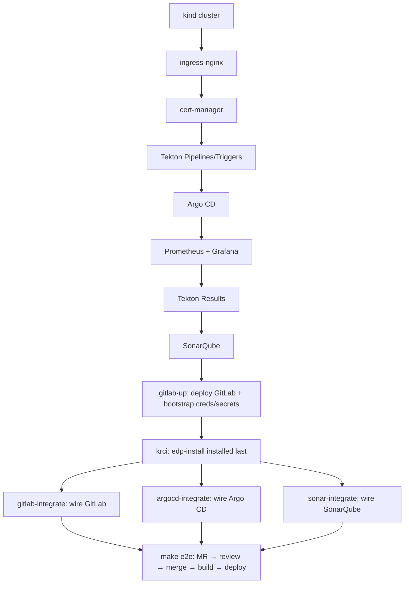
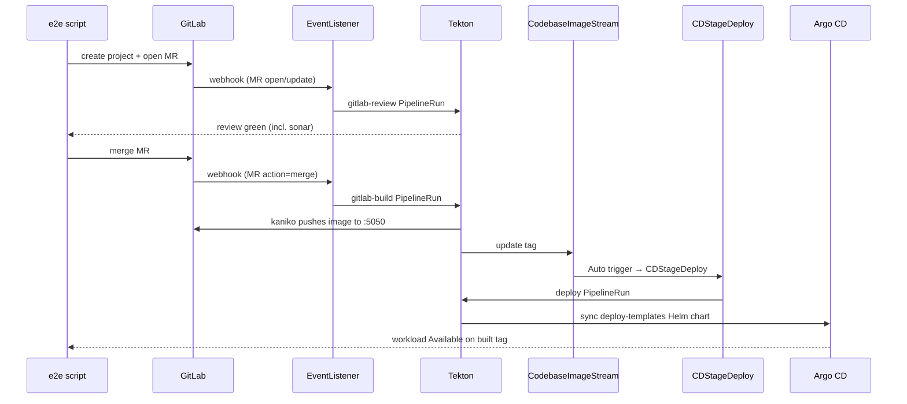

# Architecture & design

How `try-kuberocketci` stands up the full [KubeRocketCI](https://docs.kuberocketci.io)
(KRCI) platform in a local `kind` cluster, and the design decisions behind it. If
you only want to run it, see the [README](../README.md). This document explains
*why* the install is shaped the way it is — useful when you change install order,
bump versions, or debug a single component.

## Table of contents

- [Goals & non-goals](#goals--non-goals)
- [Two principles: deps-first / KRCI-last and baseline → integrate](#two-principles-deps-first--krci-last-and-baseline--integrate)
- [Install graph](#install-graph)
- [Declarative GitServer](#declarative-gitserver)
- [Split-horizon DNS](#split-horizon-dns)
- [Trust: self-signed TLS and the three CA injection points](#trust-self-signed-tls-and-the-three-ca-injection-points)
- [Container registry: reuse GitLab's own](#container-registry-reuse-gitlabs-own)
- [The Tekton task patches and the Helm SSA race](#the-tekton-task-patches-and-the-helm-ssa-race)
- [CI → CD: the review/build/deploy lifecycle](#ci--cd-the-reviewbuilddeploy-lifecycle)
- [Local deviations from a stock KRCI install](#local-deviations-from-a-stock-krci-install)

## Goals & non-goals

**Goals**

- One-command, from-zero bring-up of a *complete* KRCI platform — Git, CI, CD,
  code quality, observability, and the Portal — on a laptop.
- Every component **independently rebuildable** (`make sonar`, `make argocd`, …)
  so you can debug one piece without tearing down the rest.
- Versions **pinned to the GitOps source of truth**
  ([edp-cluster-add-ons](https://github.com/epam/edp-cluster-add-ons)) so the bed
  matches a real KRCI install.
- A fully automated **end-to-end proof** (`make e2e`) that exercises the real
  webhook → review → merge → build → deploy path, no UI clicks.

**Non-goals**

- Not production, not hardened, not HA. See [SECURITY.md](../SECURITY.md).
- Not a GitOps/Argo-CD-managed install of the platform itself — components are
  applied directly with `helm`/`kubectl` precisely so each is debuggable in
  isolation (the *workloads* KRCI deploys still go through Argo CD).

## Two principles: deps-first / KRCI-last and baseline → integrate

Two ordering rules drive the whole `Makefile`.

**1. Deps-first, KRCI-last.** Install everything KubeRocketCI depends on *before*
installing KRCI, then install the platform **last** with values that wire it to
those running dependencies. The KRCI chart can then render provider resources
(GitServer, EventListener, Ingress) against a GitLab that already exists, instead
of racing an operator to create them imperatively.

**2. Baseline → integrate split.** Each integration is done in two halves:

- **Baseline** — install the component with stock-ish config (no KRCI knowledge).
- **Integrate** — a small post-KRCI step that wires *only what the chart can't
  express itself*: a CA-trust mount, a token minted from a now-running service, a
  task patch, an integration secret.

This keeps the imperative surface area minimal and explicit. The `*-integrate`
targets (`gitlab-integrate`, `argocd-integrate`, `sonar-integrate`) are the
"integrate" halves; they are idempotent and safe to re-run after `make krci`.

## Install graph

GitLab comes up as a **platform dependency** before `make krci`, so the chart can
connect its GitServer on first reconcile. The three `*-integrate` steps run after
the platform is up. `make testbed` chains the whole graph; `make e2e` validates it.

## Declarative GitServer

The `GitServer`, its EventListener, and Ingress are rendered by the edp-tekton chart
from `edp-tekton.gitServers` in `values/edp-install.yaml` — not applied imperatively.
The rest of the GitLab wiring is split between Helm values and a little bash, by what
each can own:

| Concern | How it's handled |
|---|---|
| `GitServer` / EventListener / Ingress | chart-rendered from `edp-tekton.gitServers` |
| dockerRegistry config, kaniko custom-CA flag | Helm values |
| Git creds secrets (`ci-gitlab`, `kaniko-docker-config`, `custom-ca-certificates`) | bash, **pre-KRCI** — they carry GitLab-minted creds, so they can't be chart-owned |
| operator CA-trust mount | bash patch (no chart hook for the operator's volumes) |
| `gitlab-set-status` task fix | bash patch (upstream task body) |
| CoreDNS rewrites, `krci-gitops` codebase | bash |

Because the `ci-gitlab` secret is created **before** the chart renders the GitServer
(in `gitlab-up`, pre-KRCI), the operator's SSH connection check passes on first
reconcile and `gitserver.status.connected` flips to `true` shortly after install.

## Split-horizon DNS

One hostname must resolve differently depending on *who is asking*. This is the
crux of running a self-hosted Git provider inside `kind`:

| Asker | Needs `gitlab.127.0.0.1.nip.io` to reach | Mechanism |
|---|---|---|
| **Your browser** (host) | the kind ingress on localhost | `nip.io` wildcard → `127.0.0.1` |
| **A pod** (e.g. codebase-operator cloning) | the in-cluster GitLab Service | **CoreDNS `rewrite`** → `gitlab.gitlab.svc.cluster.local` |
| **The kind node** (containerd pulling images) | the GitLab registry ClusterIP | containerd **registry mirror** (`hosts.toml`) |

A second CoreDNS rewrite points the **EventListener** host
(`el-gitlab-krci.<wildcard>`) at `ingress-nginx` so GitLab's webhook POST reaches
the EL from inside the cluster. Both rewrites are installed by
`scripts/gitlab-up.sh`. No `/etc/hosts` edits are ever required on the host.

## Trust: self-signed TLS and the three CA injection points

The codebase-operator's GitLab REST client **only speaks HTTPS** (the `GitServer`
CRD exposes `httpsPort`, never plain HTTP). So GitLab must serve TLS — it does, with
a self-signed cert (`secret/gitlab-tls`). That self-signed CA must then be trusted
in three distinct places, each with its own mechanism:

1. **codebase-operator** — a **bash patch** adds the CA volume/mount (the chart has
   no hook for the operator's pod volumes). `skipWebhookSSLVerification` covers only
   *webhooks*, not the API client, so the mount is mandatory.
2. **gitfusion** (the Portal's git-discovery API) — **declarative** CA volume in
   `values/edp-install.yaml` (applied at install time, no patch needed).
3. **kind node containerd** — `hosts.toml` with `skip_verify` for registry pulls.

kaniko is a fourth consumer but trusts the CA via a chart flag
(`edp-tekton.kaniko.customCert: true`) reading `secret/custom-ca-certificates`.

## Container registry: reuse GitLab's own

Stock KRCI leaves `global.dockerRegistry` empty. Here, build pipelines push to
**GitLab's bundled Container Registry** at `gitlab.127.0.0.1.nip.io:5050`:

- KRCI has no "gitlab" registry *type*, so it's declared as **harbor** (a generic
  private registry). With `space: krci`, kaniko pushes
  `…:5050/krci/<codebase>` — which maps cleanly to each codebase's own GitLab
  project registry.
- A **group deploy token** (read+write registry) backs both push
  (`kaniko-docker-config`) and pull (`regcred`).
- kaniko trusts the self-signed registry cert via `kaniko.customCert: true`.

This avoids standing up a separate registry (Harbor/Nexus) just for local testing.

## The Tekton task patches and the Helm SSA race

Two stock Tekton tasks need local-only fixes, applied by the `*-integrate` steps
**after** `make krci`:

- **`gitlab-set-status`** — the stock task mis-parsed our `ssh://…:32222/…` git URL
  (it posted status to host `ssh`) and verified TLS against the self-signed cert,
  aborting every run at `report-pipeline-start-to-gitlab`.
  `scripts/gitlab-set-status.py` extracts the host from any URL form and skips TLS
  verification.
- **`deploy-applicationset-cli`** — the `argocd` CLI defaults to TLS, but our server
  runs plaintext; the patch adds `--plaintext` to `ARGOCD_OPTS`.

**Why re-apply?** Helm 4 server-side apply (SSA) resets these tasks to chart-stock
on every `make krci`. So `make krci` uses `--force-conflicts`, and the integrate
steps **re-apply** the patches afterward. This is why patches live in the
"integrate" half, not baked into the chart.

## CI → CD: the review/build/deploy lifecycle

`make e2e` (`scripts/e2e.sh`) drives the full lifecycle against a sample Go/Gin
codebase, with **no UI interaction**:

The **review/build trigger split** lives in the EventListener `Trigger` CRs:
`gitlab-review` fires on MR `open/reopen/update` (+ note hooks); `gitlab-build`
fires on MR action `merge`. So **merging** the MR — not a separate push — kicks the
build. All PipelineRuns are recorded in Tekton Results.

> **Known quirk:** GitLab can deliver the MR webhook twice, creating two concurrent
> review runs; the duplicate gets a harmless `400` posting the same commit-status
> context. The e2e script asserts at least one run is fully green.

## Local deviations from a stock KRCI install

This is the authoritative list of how the test bed differs from a stock,
GitOps-managed KubeRocketCI install. The task patches, CA trust, DNS, and registry
each have a dedicated section above; this is the roundup:

- **helm/kubectl, not Argo CD GitOps**, for the platform install itself — each
  component debuggable in isolation; versions still pinned to edp-cluster-add-ons.
- **In-cluster Portal** — the `krci-portal` subchart wired to in-cluster Services
  (`portal-config` + secret `krci-portal-secret`, HTTPS ingress), running under
  Docker Desktop's Rosetta on Apple Silicon (amd64 image). OIDC login is left
  unwired (no issuer in kind).
- **Patched Tekton tasks** — `gitlab-set-status` (host parsing + TLS skip) and
  `deploy-applicationset-cli` (`--plaintext`). Helm 4 SSA resets both on each
  `make krci`, so the install uses `--force-conflicts` and the integrate steps
  re-apply. See [the task patches](#the-tekton-task-patches-and-the-helm-ssa-race).
- **Argo CD single instance** (one replica each, single Redis, dex/notifications
  off) instead of KRCI's documented HA install. Uses the latest chart (`9.5.17`;
  add-ons pins `9.5.13`) and adds an apps-in-any-namespace ApplicationSet RBAC
  grant (`manifests/argocd-appset-rbac.yaml`) the chart omits.
- **SonarQube** — an own minimal Postgres (`postgresql.enabled: false` +
  `jdbcOverwrite`) instead of the chart's bundled DB or Crunchy PGO. The chart
  needs `monitoringPasscode` to become Ready, and its `setAdminPassword` hook
  automates the forced first-login password change.
- **Tekton Results** — a single stock `postgres:16-alpine` (Crunchy PGO
  intentionally not installed), used unmodified except for pinning the `logs` PVC
  namespace.
- **Self-hosted GitLab** with a self-signed cert as a platform dependency — see
  [Trust](#trust-self-signed-tls-and-the-three-ca-injection-points) and
  [Split-horizon DNS](#split-horizon-dns) — with its bundled
  [Container Registry reused](#container-registry-reuse-gitlabs-own) as KRCI's
  image registry.

See also [gitlab-integration.md](gitlab-integration.md) for the webhook path in
depth.
